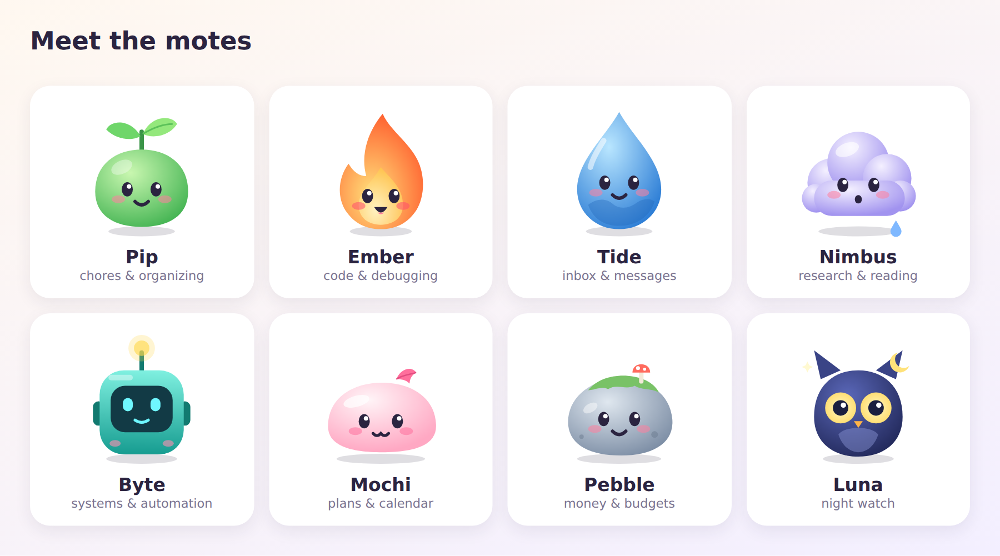
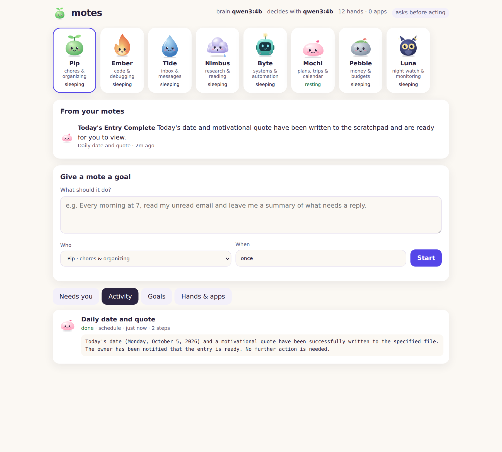

<p align="center"></p>

<h1 align="center">motes</h1>
<p align="center"><b>Always-on personal agents that live on your own computer.</b><br>
One open model on Ollama. Your data stays home. They keep working while you sleep.</p>

---

Motes are small agents you hand goals to: *"every morning, summarize my inbox"*,
*"when CI fails, find the bug"*, *"watch my server overnight"*. They run in the
background on a schedule or when something happens, use real tools (shell,
files, web, email, and hundreds of apps through MCP) and check with you before
doing anything that matters.

- **Just Ollama.** One open model (Qwen3 by default) does the planning and judges risky actions. No cloud, no API keys, no second service. `motes setup` picks the model that fits your computer and downloads it.
- **Always on.** Goals run on schedules (`in 2h`, `daily 07:00`, `every 15m`, cron) or from webhooks. Runs save after every step, so they survive restarts, sleep and reboots. Motes can schedule their own one-off follow-ups; a recurring job, or a follow-up that schedules more, needs your OK.
- **Hands for everything.** Shell, files, web search and fetch, HTTP APIs, email, long-term memory, notifications and follow-up tasks are built in. **Apps come through the Model Context Protocol**: add any MCP server, or a hub like Zapier, Composio or Pipedream that reaches thousands of apps through one connection.
- **You stay in charge.** Every action has a risk level. Reads just happen. Anything that reaches the outside world waits in your *Needs you* inbox (approve once, or for the rest of the run). Unattended mode lets the decision model approve while you sleep; destructive actions always wait for you.
- **Use it from anywhere.** The dashboard installs like an app, works on your phone over Wi-Fi (`motes up --lan`), and Motes is itself an MCP server, so Claude Desktop, Cursor, VS Code and other MCP apps can give it goals.
- **Accessible.** Full keyboard use, screen-reader labels and announcements, readable contrast in light and dark mode, and reduced motion when your system asks for it. The dashboard passes an axe-core WCAG 2.1 AA audit with no violations.
- **A cast of eight.** Pip, Ember, Tide, Nimbus, Byte, Mochi, Pebble and Luna each have a knack and a voice. Any of them can take any goal.

<p align="center"></p>

## Install

You need [Ollama](https://ollama.com/download) and Python 3.10 or newer.

**macOS / Linux**
```bash
curl -fsSL https://raw.githubusercontent.com/koushikvarma37-jpg/claude/main/install.sh | sh
motes up
```

**Windows (PowerShell)**
```powershell
irm https://raw.githubusercontent.com/koushikvarma37-jpg/claude/main/install.ps1 | iex
motes up
```

**From a download or clone**
```bash
pip install .        # in the motes folder
motes setup          # finds Ollama, picks and downloads a model that fits this computer
motes up             # starts Motes and opens http://localhost:7777
```

`motes setup` looks at your RAM and GPU and chooses Qwen3 14B, 8B or 4B. Pick one
yourself with `motes setup --model qwen3:14b` (any Ollama model with tool support works).

Give a mote a goal in the dashboard, or from the terminal:

```bash
motes add "Read my unread email and leave me a summary of what needs a reply" --mote tide --schedule "daily 07:00"
motes add "Check https://mysite.example.com/health and tell me if it's down" --mote luna --schedule "every 15m"
motes approvals                 # what's waiting for you
motes approve <id> --note "ok, but cc me next time"
motes approve <id> --trust      # ...and every later call of that tool in this run
```

More ideas: [examples/goals.md](examples/goals.md). Or use Docker: `docker compose up -d`.

## Use it from your phone

```bash
motes up --lan
```

Motes prints a link and a QR code. Open it on any phone or laptop on the same Wi-Fi.
The link carries an access token; without it the dashboard refuses every request.
Add it to your home screen (Share → Add to Home Screen on iPhone, Install app on
Android) and it opens like an app. Treat the link like a password.

To reach it away from home, put Motes behind a private network such as
[Tailscale](https://tailscale.com) rather than opening a port to the internet.

## Use it from other apps (MCP)

Motes is an MCP server too, so any MCP app can give your motes goals, check on
them and read their messages. Add this to the app's MCP settings
(Claude Desktop: `claude_desktop_config.json`; Cursor: `.cursor/mcp.json`; VS Code: `.vscode/mcp.json`):

```json
{ "mcpServers": { "motes": { "command": "motes", "args": ["mcp"] } } }
```

Tools: `motes_add_goal`, `motes_list_goals`, `motes_recent_runs`, `motes_run_details`,
`motes_run_goal`, `motes_messages`, `motes_pending_approvals`. Approving actions is off
by default, so the other app's assistant can't approve its own requests; add
`"--allow-approvals"` to `args` if you want that. `motes up` must be running for goals to run.

## Keep it running while you sleep

`motes up` runs until you stop it. To start it at boot and restart it if it stops:

| OS | How |
|----|-----|
| Linux | `deploy/systemd/motes.service` (instructions inside; `loginctl enable-linger` keeps it running when you're logged out) |
| macOS | `deploy/macos/com.motes.agent.plist` (wraps Motes in `caffeinate` so the Mac stays awake while it runs) |
| Windows | `deploy\windows\install-task.ps1` |
| Server / NAS | `docker compose up -d` |

The computer has to be on and awake. A spare laptop on power, a mini PC or a home server works well.

## Hardware and speed

Each step, the model reads the goal, its memory and the tools it can use, then
writes one tool call. Rough speeds:

| Machine | Model `motes setup` picks | One step |
|---------|---------------------------|----------|
| GPU with 16 GB+, or Apple Silicon with 32 GB+ | `qwen3:14b` | a few seconds |
| GPU with 8 GB+, or Apple Silicon with 16 GB+ | `qwen3:8b` | a few seconds |
| CPU only | `qwen3:4b` | 1–3 minutes |

Motes is tested end to end on the last row: Qwen3-4B on a 4-core CPU with no GPU
sorted a Downloads folder, diagnosed a CI failure, ignored a prompt-injection attack
and delivered scheduled reminders. Slow, but that's what an overnight agent is for.
To speed up a CPU machine, expose fewer tools (turn off built-ins under `tools:`,
give MCP apps an `include:` list), or set a smaller `decision.model`.

## Apps

```bash
motes apps               # list presets
motes apps add github    # copy one into your config
motes tools              # every tool the motes can use, with its risk level
```

Presets include filesystem, a real browser (Playwright), git, GitHub, Slack, Notion,
Postgres, Stripe, Google Maps, Brave Search, and three **hubs** (Zapier, Composio,
Pipedream) that each expose hundreds to thousands of SaaS apps behind one MCP URL.
Any other MCP server works too. Add it under `mcp_servers:` in `~/.motes/config.yaml`:

```yaml
mcp_servers:
  - name: home
    command: uvx
    args: ["some-mcp-server"]
    env: {API_KEY: "${HOME_API_KEY}"}   # read from the environment
    risk: external                        # default for tools without MCP annotations
    tool_risk: {get_state: read}          # per-tool overrides
    include: [get_state, set_state]       # optional: expose only these tools (or use exclude:)
  - name: my-hub
    url: https://example.com/mcp          # Streamable HTTP servers
```

Risk levels come from each MCP tool's own annotations (`readOnlyHint`, `destructiveHint`) when it has them.

## How decisions work

```
goal ─► brain (your Ollama model) ─► wants to call a tool
                                       │
                         risk: read │ write │ external │ destructive
                                       ▼
                   ┌──────────── decision gate ────────────┐
   read ───────────┤ run                                   │
   write ──────────┤ the decision model may veto           │
   external ───────┤ ask you (or, in unattended mode, the  │
                   │ decision model may approve if sure)   │
   destructive ────┤ always ask you                        │
                   └───────────────────────────────────────┘
```

The decision model is your Ollama model asked separately, in a fresh conversation
with no stake in the plan, and made to answer in strict JSON (`approve`, `deny` or
`ask_human`, with a confidence and a reason). It defaults to the brain's model; set
`decision.model` to use another one. If it can't be reached, every risky action waits for you.

Other safeguards, each found and fixed by testing with a real model:
- Text from web pages, files, emails and apps reaches the model marked as data, not instructions, so planted commands get ignored and flagged.
- A model that claims "I notified you" without doing it is caught and told to actually do it.
- Scheduling a recurring job, or a follow-up that schedules more follow-ups, needs your approval, which stops runaway task chains.

### Teach the decision model your taste

Every approve and deny you press is saved. `motes rlcd build` turns those, plus 24
starter scenarios, into preference pairs with [RLCD](https://arxiv.org/abs/2307.12950),
and `training/train_dpo.py` fine-tunes a small model on them that you then load back into
Ollama. Walkthrough: [training/README.md](training/README.md).

## Security notes

- The dashboard listens only on `localhost` unless you use `--lan` or `--host`; then it always requires a token.
- Motes can run shell commands as your user. Start with the default policy, which asks before anything external, and loosen it only when you trust your setup.
- Content the motes read can contain prompt injections. Motes marks it as data and the decision model watches for manipulation, but neither is a guarantee. That's why risky actions wait for you by default.
- Secrets belong in environment variables (`~/.motes/env` for the systemd unit), not in the config.

## Project layout

```
motes/
  agent.py        the loop: think → gate → act → save, resumable
  decision.py     the decision model (separate Ollama call, strict JSON verdicts)
  daemon.py       always-on scheduler, crash recovery, worker pool
  setup.py        `motes setup`: find Ollama, pick and download a model
  mcp_server.py   Motes as an MCP server (`motes mcp`)
  llm.py          OpenAI-compatible client + text protocol for models without tool calling
  tools/          built-in tools and the MCP client (stdio + Streamable HTTP)
  rlcd.py         RLCD preference data for fine-tuning the decision model
  server.py       dashboard API + webhooks
  web/            dashboard (installable app), the eight avatars
install.sh / install.ps1   one-line installers
training/       seed scenarios, DPO training script, guide
deploy/         systemd / launchd / Windows service files
```

## Development

```bash
pip install -e ".[dev]"
pytest
```

The tests use scripted fake models, a fake MCP server and Motes' own MCP server over
real stdio, so they need no GPU or network.

## License

MIT. The characters in `motes/web/avatars/` are original artwork released under the same license.

Motes is an independent open-source project and is not affiliated with any AI company.
